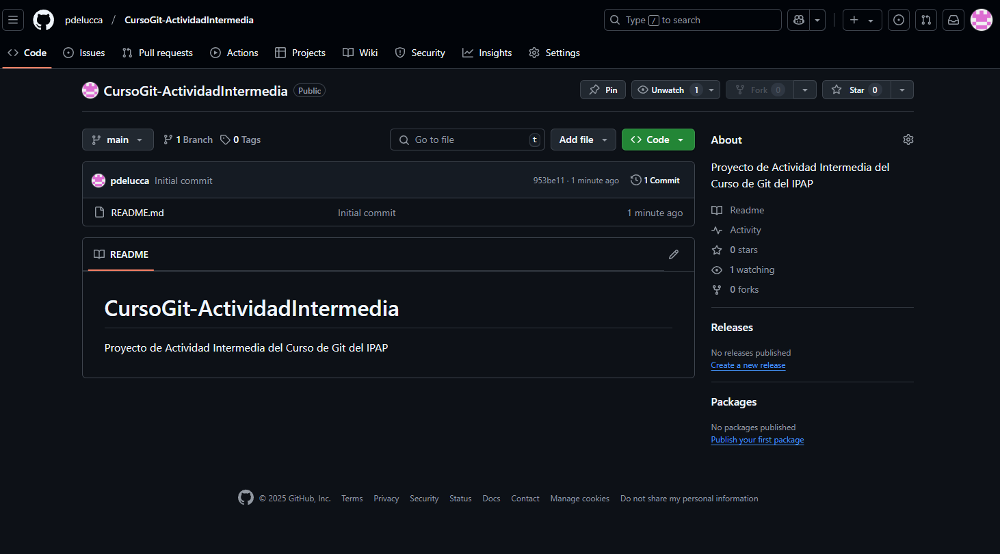
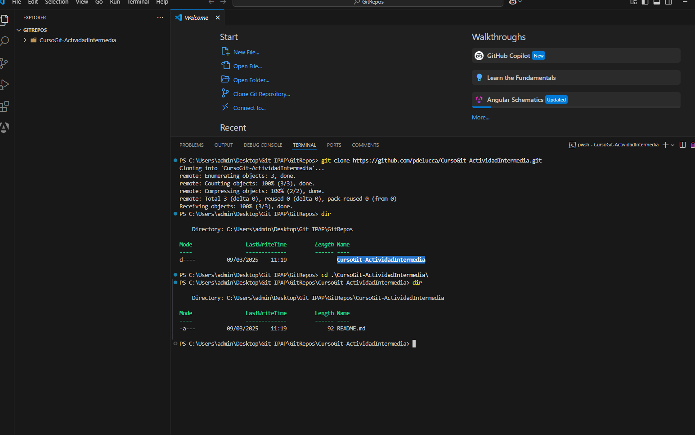

 

# 1er Repositorio Curso Git - [pdelucca](https://github.com/pdelucca)

## _Actividad Intermedia_

Repositorio de demostración de conocimientos adquiridos hasta la clase 2. Se describen las tareas realizadas mediante captura de pantallas y texto que muestra el paso a paso de los objetivos planteados en actividad intermedia.

## Objetivos

- [Creación del Repositorio en una herramienta en la nube](#creaci%C3%B3n-del-repositorio-en-una-herramienta-en-la-nube)
- [Clonación local desde consola en VS Code](#clonaci%C3%B3n-local-desde-consola-en-vs-code)
- Creación de directorio de imagenes registrando con capturas el paso a paso de las tareas
- [Generación del Primer Commit con el estado hasta el momento](#generaci%C3%B3n-del-primer-commit-con-el-estado-hasta-el-momento)
- [Creación de directorio de documentación de modulos hasta la clase 2 y otras modificaciones](#creaci%C3%B3n-de-directorio-de-documentaci%C3%B3n-de-modulos-hasta-la-clase-2-y-otras-modificaciones)
- [Creación del segundo Commit con el estado hasta el momento](#creaci%C3%B3n-del-segundo-commit-con-el-estado-hasta-el-momento)
- [Agregar documento Cuestionario.md del cuestionario planteado en la actividad junto con sus respuestas](#agregar-documento-cuestionariomd-del-cuestionario-planteado-en-la-actividad-junto-con-sus-respuestas)


## Creación del Repositorio en una herramienta en la nube

Se crea el repositorio CursoGit-ActividadIntemedia mediante la interfaz gráfica de Github (se incluye el archivo readme.md):



## Clonación local desde consola en VS Code
Dentro de la consola de vs code se ejecuta el comando
```sh
git clone https://github.com/pdelucca/CursoGit-ActividadIntermedia.git
```



## Generación del Primer Commit con el estado hasta el momento
   - Se ejectua git status para ver el estado actual de los archvios del proyecto
   - Luego de agregar los archivos al stage con el comando:
   
      ```sh
      git add .
      ```
   - Finalmente generar la versión con commit en el repositorio local:
     
     ```sh
     git commit -m "Se comnpletó el readme.md y se agregaron las imagenes de captura de la actividad intermedia"
     ```

      Los resultados del add y del commit se detallan en la siguiente captura:


      

  ## Creación de directorio de documentación de modulos hasta la clase 2 y otras modificaciones

  Se crea la carpeta Documentación módulos con archivos hasta la clase 2 y tambien se copia al directorio raiz el archivo de actividad intermedia.
  También se agrega el logo del ipap al archivo readme.md

  ## Creación del segundo Commit con el estado hasta el momento
  
  Al igual que en el versionado anterior se realiza el add y luego el commit. 

  ```sh
  git commit -m "Se agregó la carpeta de documentación del curso y se actualizó el readme.md"
  ```

   > **_Nota:_** Está claro que en los mensajes de ambos commit se debe describir brevemente las tareas que se realizaron para cada versión. En este caso, como las tareas están detalladas en este mismo documento, se resalta en el mensaje las tareas para mejor comprensión de los pasos realizados en el curso.


También se ejecuta el log para listar los commit en el repositorio local:
```sh
git log
```

 con la siguiente salida:

   ![Clonado de Repositorio][def]

   [def]: imagenesActividadIntermedia/gitlog.png

   
## Agregar documento Cuestionario.md del cuestionario planteado en la actividad junto con sus respuestas
Se agregó el documento cuestionario.md a la carpeta cuestionario. También se lo agregó en formato docx


###	Principales diferencias entre Subversion (SVN) y Git 

 Subversion tiene una arquitectura centralizada con repositorio único. En cambio Git al ser distribuido ofrece mayor confiabilidad, velocidad y control a través del repositorio local. Esto impica que podemos trabajar generando branchs y commits sin tener conexión permanente con el servidor.
Esta arquitectura de git redunda también en un mejor manejo de las ramas, fusionado (merge) o eliminar ramas  y mucho más veloz al realizar operaciones como commit e historial en local.
También esta arquitectura permite a cada desarrollador tener el proyecto completo en local facilitando el trabajo con total independencia.
Además git no rastrea cambios a nivel de archivos como lo hace SNV. Git lo hace a través de instantáneas de todo el proyecto, optimizando la manera de almacenar y referenciar cada versión.

### Principales diferencias entre GitLab y GitHub
Github se centra básicamente en el repositorio y el control de versiones mientras que GitLab es mas completo ya que ofrece un enfoque para todo el ciclo de vida del desarrollo en la misma plataforma.
Github cuenta con: GitHub Actions, que permite automatizar flujos de integración continua, que es un proceso donde los cambios se integran automaticamenste mediante el proceso de compilación, ejecución de pruebas y validaciones. Los conflictos en el desarrollo suelen notarse antes de que se acumulen.
La plataforma Gitlab ofrece la posibilidad de instalarse en un entorno de servidor local. Esto permite el trabajo de un equipo de desarrollo sin obligación de  conexión a la nube.
Además gitlab ofrece su núcleo en código abierto mientras que github no es completamente open source.

[Documentación Detallada(formato MD)](Cuestionario/Cuestionario.md)

[Documentación Detallada(formato Word)](Cuestionario/Cuestionario.md)